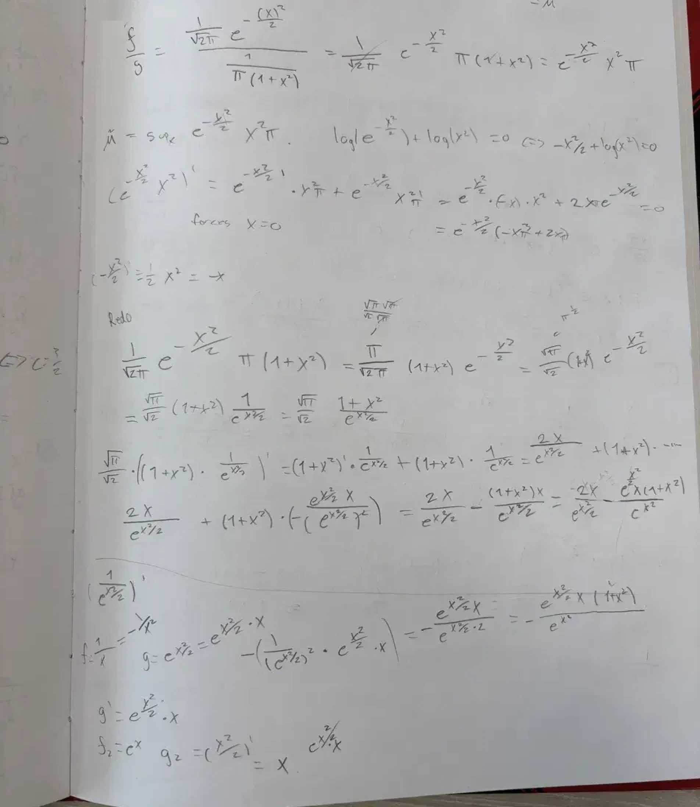
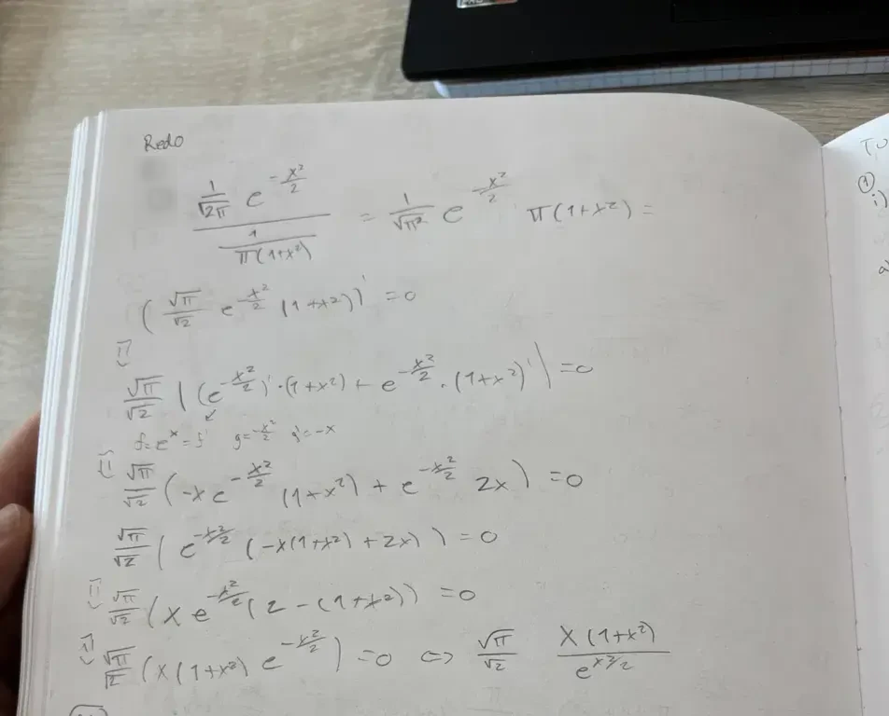
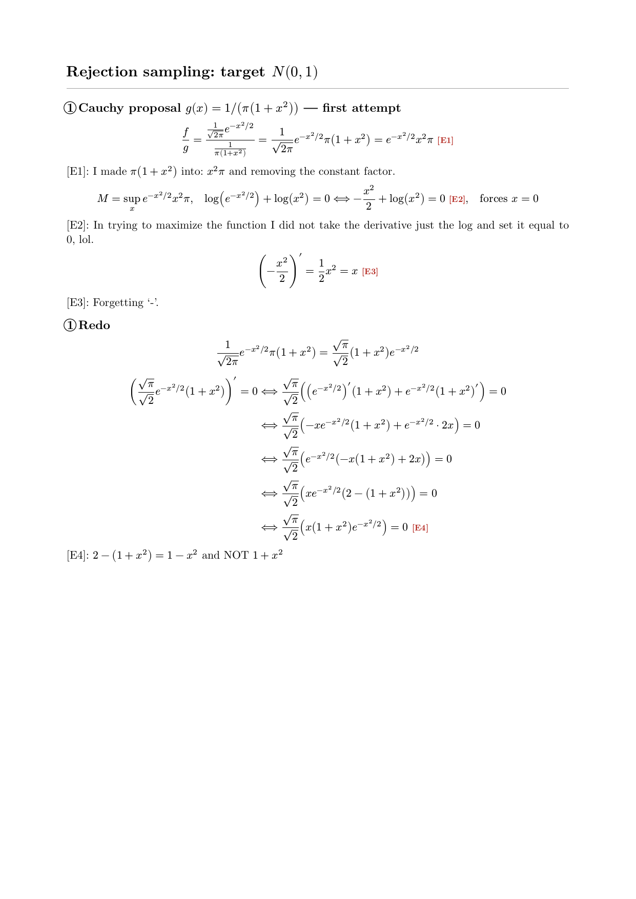
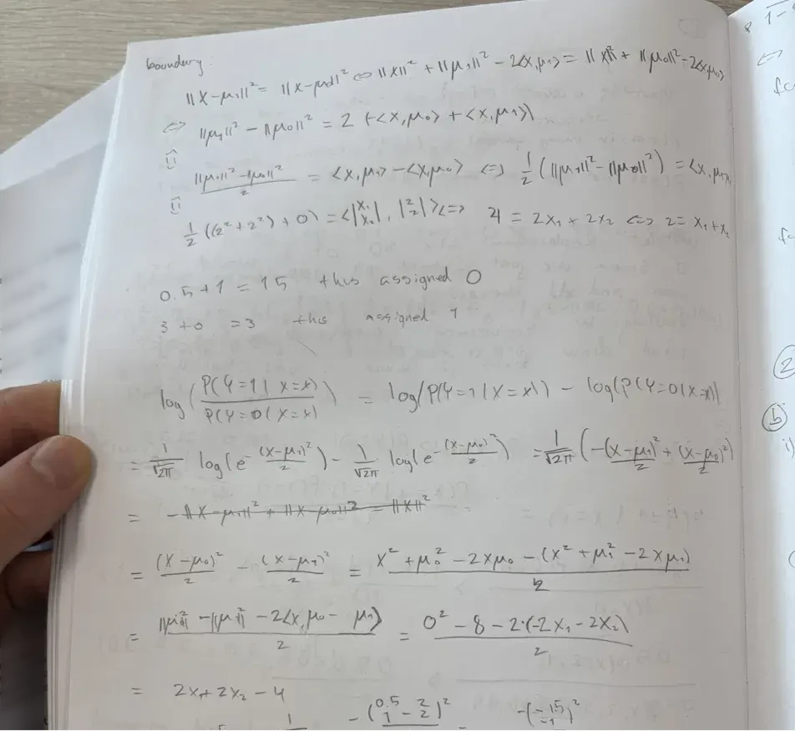
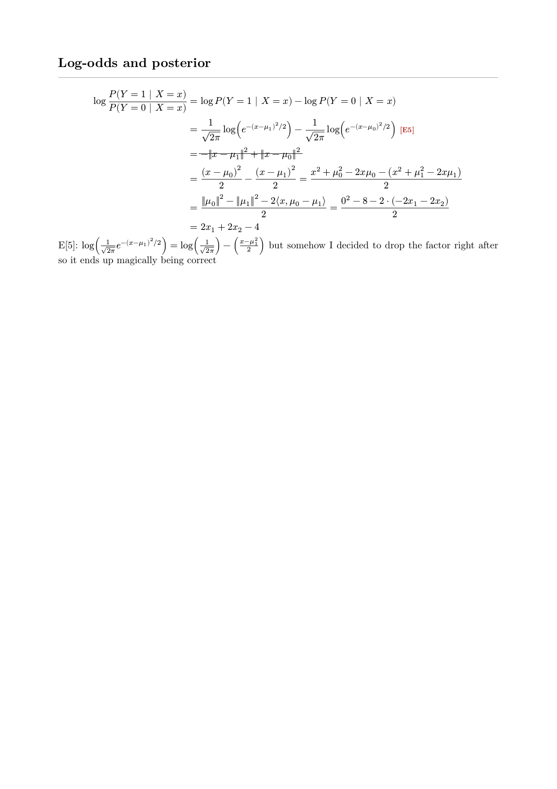
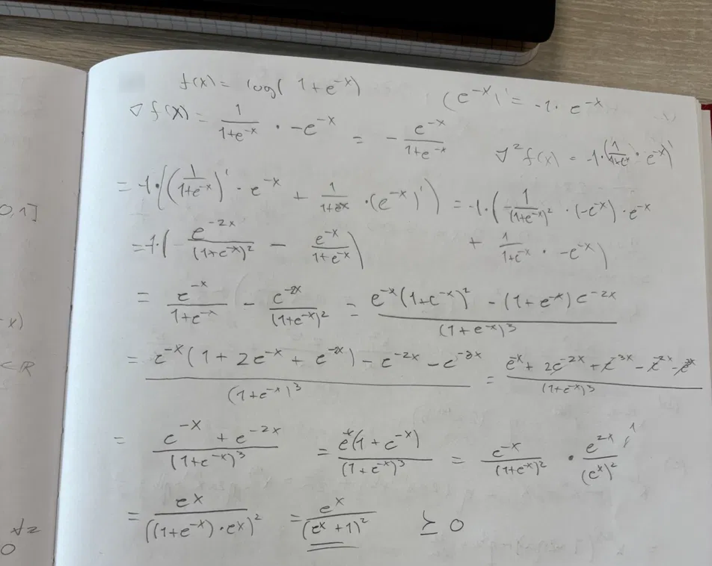
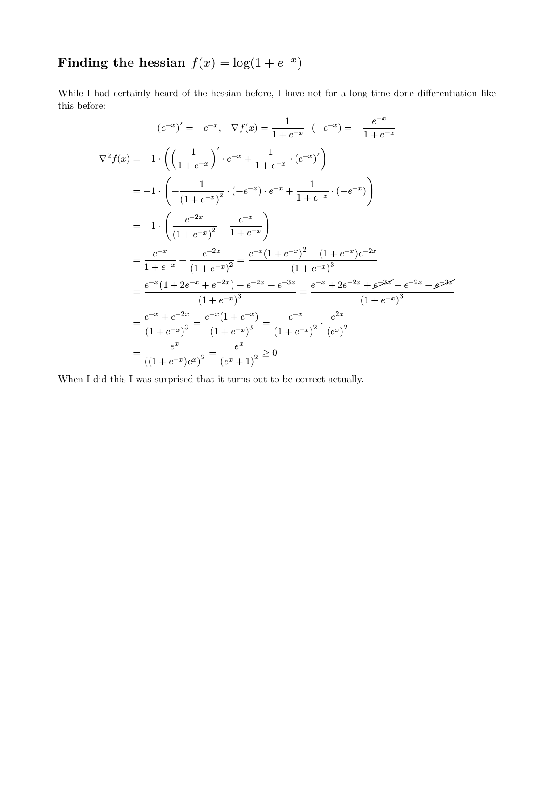

My honest experience of studying math at NUS as a danish CS student: have your basics in order!

## Background
The first two years of my undergraduate degree in computer science have been spent at Aarhus University in Denmark. This have certainly been great and I have definitely learned a lot along they way.

This semester however, I decided to challenge myself and do a semester abroad at NUS.
For this semester I therefore took some courses that I felt were a bit out of reach for me.

And while a semester abroad certainly in itself is not necessarily a challenge, I have been quite astonished at the difficulty of the courses I chose.

## My coursework
At NUS they have levels 1000 through 4000 of courses for undergraduate students. 1XXX are considered entry classes for bachelor students while 4XXX are the most advanced and specialized courses you are allowed to do as an undergraduate student (and exchange student - no matter your home level). I am currently doing four level 4k (math department, statistics and datascience department) and one level 3k (statistics and datascience department).

**Full disclosure:** I am not doing an undergradute degree in math and did antipicate (hoped) I would be challenged.

## To the point (and the Problem)

And now to the point of this post: my arithmetic by hand skills sucked before getting to NUS.

When I got NUS the first couple of weeks of curriculum were pretty chill, but then suddenly the workload exploded.
This is normal way of a semester at any university, I think. But something was different this semester. I found every single exercise so insanely difficult, and for the first few weeks I had such a hard time getting anything correct.

 I soon realized my problem.
In my studies at Aarhus I have mostly relied on computers to do rigorous arithmetic, integration and differentiation and I have not done any proof based courses (like mathematical analysis or similar).

 So my issue was that my most basic skills in maths were completely out of shape - not specifically any point, but rather that I had a hard timewith:
 arithmetic, integrals, differentials, statistical calculations and the like by hand.

This terrified me since I knew this is not a skill you simply pick up over night, it takes time doing that stuff by hand and getting a feeling for it.

To see what I was struggling with here are some of my calculations from :

### Rejection sampling

::: {.grid}
::: {.g-col-12 .g-col-md-6}
*My handwritten attempt*

*The redo still not correct though*

:::
::: {.g-col-12 .g-col-md-6}
*Typeset, with my mistakes marked*

:::
:::

### Log-odds and posterior

::: {.grid}
::: {.g-col-12 .g-col-md-6}

:::
::: {.g-col-12 .g-col-md-6}

:::
:::

### Finding the Hessian

::: {.grid}
::: {.g-col-12 .g-col-md-6}

:::
::: {.g-col-12 .g-col-md-6}

:::
:::

Most of the errors I made were just small slips like forgetting a '-' or not remembering that x/y = 1/y * x and so on. However such errors compound over long calculations AND they are insanely hard to spot for yourself.

## The solution
So I realized I had to go back to the basics of what I had learned, that meant:

- Math takes time so slowly doing things often fixes the worst errors
    - On a lot the exercise sheets there were 10 or so exercises and I tried to frantickly finish them all asap. This left me with no real answers and often no reward for spending my time on that. Instead I started spending a fixed amount of time on the problem sheets and did the exercises in the time they took.
- Pulling out my old high school formula book
    - This holds the most basic formulations of math and knowing it by heart can get you insanely far - even at University
- Studying my wrong answers and redoing them
    - Everytime I made arithmetic errors I would go over the solution until I understood it and then redo the problem by myself.

## Conclusion
As stated above: Math takes time (AND PAPER, I filled over 60 pages of A4 paper during my recess week studying for my midterms).

This first half of my semester has taught me some completely different things than I had expected.

I would have expected to learn a lot about ML, statistical learning methods, etc. And while I certainly have learned a lot of new stuff. The biggest gain for me personally have been that I now feel a lot more confident around mathematics and statistics.

I can get to the solutions in most of the problems in the mathematics courses I am taking (and will go on to take). And difficult problems can be solved if you master the basics.
